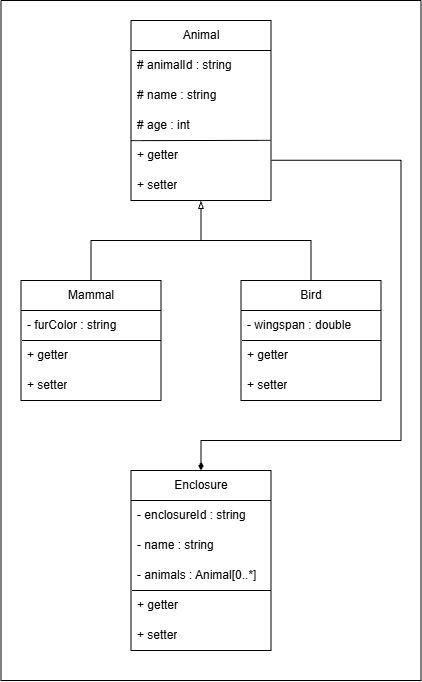
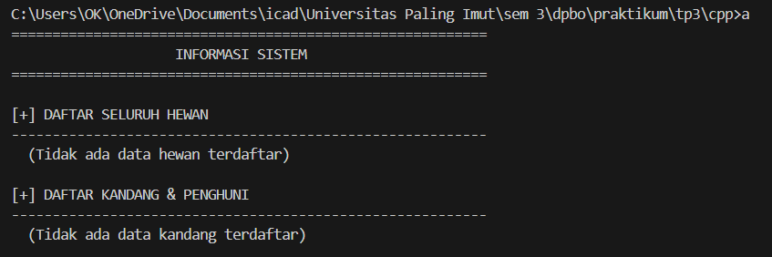
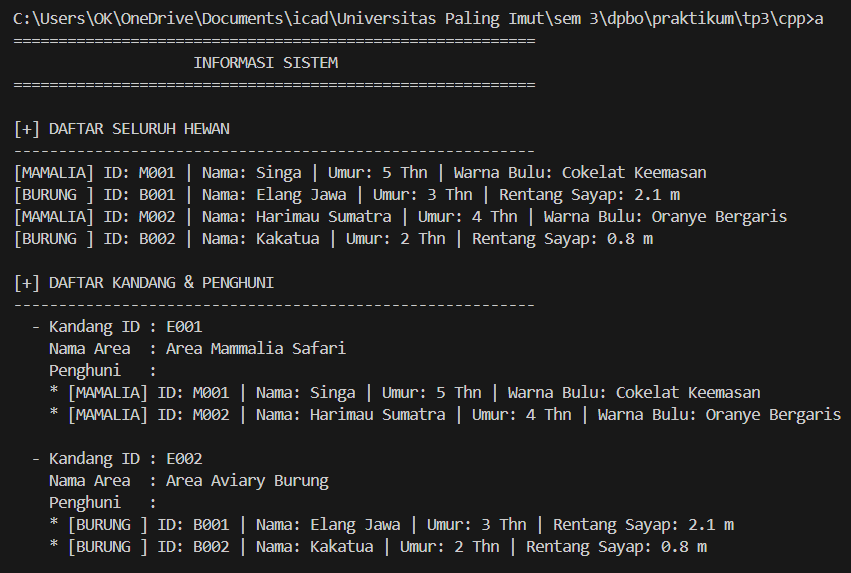
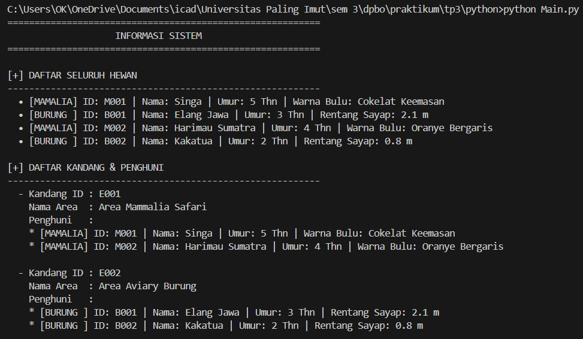
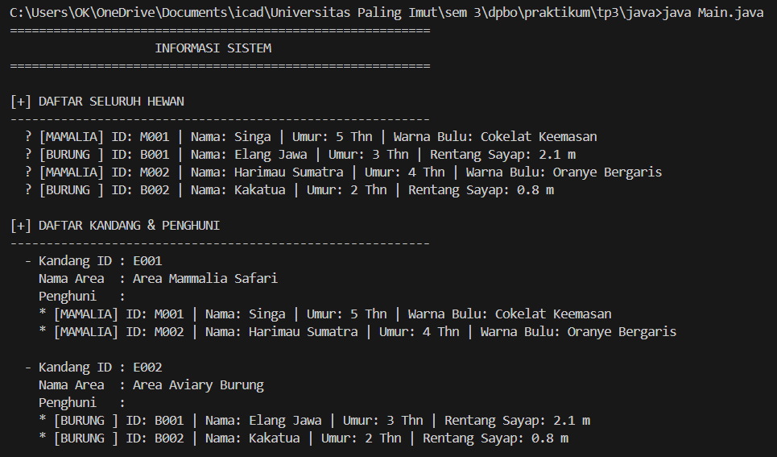

# 🦁 TUGAS PRAKTIKUM 3 DPBO 

Buat program berbasis OOP dengan minimal 3 kelas menggunakan bahasa pemrograman C++ dan Python dengan tema bebas. implementasi utama konsep:
- inheritance
- composition
- array of object (bisa pake vector)

Bonus nilai jika menambahkan bahasa Java dan mengimplementasikan minimal satu dari materi:
- Hierarchical inheritance
- Multiple inheritance
- Hybrid inheritance

---

# 🤝🏻 JANJI
Saya, Irsyad Afif Musyaffa dengan NIM 2508023, mengerjakan Tugas Praktikum 3 dalam mata kuliah Desain dan Pemrograman Berorientasi Objek untuk keberkahan-Nya. Maka saya tidak melakukan kecurangan seperti yang telah dispesifikasikan. Aamiin.

---

# ⚒️ DIAGRAM KELAS 

 

### 🛠️ Implementasi Konsep
- **Hierarchical Inheritance**: `Mammal` dan `Bird` menuruni kelas dasar `Animal`.
- **Composition**: `Enclosure` menampung kumpulan objek `Animal` via `vector<Animal*>`.
- **Abstract Class**: `Animal` bertindak sebagai kelas induk abstrak dengan *pure virtual function* `displayInfo() = 0`.
- **Polymorphism**: Pemanggilan method `displayInfo()` secara dinamis sesuai instansiasi konkrit objek hewan.
- **Array of Objects**: Penggunaan `std::vector` untuk penampungan dinamis objek pointer.

---

## 🔗 Relasi dan Deskripsi Setiap Kelas

1. **Class `Animal` (Abstract Superclass)**
   merupakan kelas dasar (*parent class*) bersifat abstrak yang menampung atribut umum hewan seperti `animalId`, `name`, dan `age`.
   * Atribut bersifat **`protected`** agar dapat diakses secara langsung oleh kelas turunan (`Mammal` dan `Bird`) pada instruksi konstruktor.
   * Deklarasi `virtual void displayInfo() const = 0;` memaksa setiap kelas turunan melakukan *method overriding*.

2. **Class `Mammal` (Subclass)**
   Merupakan turunan dari `Animal` (*Hierarchical Inheritance*). Memiliki atribut spesifik `furColor` yang bersifat **`private`** untuk menjaga enkapsulasi data. Kelas ini melakukan *override* pada method `displayInfo()`.

3. **Class `Bird` (Subclass)**
   Merupakan turunan dari `Animal` (*Hierarchical Inheritance*). Memiliki atribut khusus `wingspan` dengan akses **`private`** dan mengimplementasikan tampilan spesifik pada `displayInfo()`.

4. **Class `Enclosure` (Container / Composite Class)**
   Merupakan wadah area/kandang yang memiliki relasi **Composition** terhadap `Animal`. 
   * Menggunakan `vector<Animal*>` untuk menampung banyak data hewan (`Animal[0..*]`).
   * Memiliki instruksi pembersihan memori dinamis (`delete a`) pada destruktor `~Enclosure()` untuk menjamin hubungan kepemilikan penuh terhadap objek `Animal` di dalamnya.

---

# ⛔️ ALUR EKSEKUSI PROGRAM (`Main.cpp`)

1. **Inisialisasi Area Kandang (`Enclosure`)**
   Program membuat objek kandang seperti `Area Mammalia Safari` (`enc1`) dan `Area Aviary Burung` (`enc2`).
2. **Instansiasi Objek Hewan Dinamis (`Animal*`)**
   Program membuat objek hewan secara dinamis melalui pointer `Animal*` dengan mengalokasikan memori untuk `Mammal` (misal: Singa, Harimau Sumatra) dan `Bird` (misal: Elang Jawa, Kakatua).
3. **Pemasukkan Hewan ke Kandang (Composition)**
   Hewan-hewan dimasukkan ke dalam area kandang masing-masing memanfaatkan fungsi `addAnimal()`.
4. **Pengelompokan ke Vector Sistem (Array of Objects)**
   Seluruh pointer `Animal*` dan pointer `Enclosure*` dihimpun ke dalam `vector<Animal*>` dan `vector<Enclosure*>` untuk mempermudah iterasi data.
5. **Menampilkan State Sebelum / Kondisi Kosong**
   Memastikan penanganan kondisi *empty state* saat belum ada data terdaftar di dalam sistem.
6. **Menampilkan Informasi Terstruktur Setelah Add Data Secara Statis**
   - Menampilkan seluruh daftar hewan menggunakan eksekusi polimorfik `a->displayInfo()`.
   - Menampilkan rincian daftar kandang beserta daftar seluruh penghuninya.
7. **Pembersihan Memori**
   Destruktor pada `Enclosure` dijalankan secara otomatis untuk menghapus alokasi objek `Animal` yang berada di dalamnya secara aman.

---

# 📸 DOKUMENTASI EKSEKUSI PROGRAM

## Tampilan Sebelum Data Terisi (Empty State)

## Tampilan Eksekusi Utama Program C++

## Tampilan Eksekusi Utama Program Python

## Tampilan Eksekusi Utama Program Java

